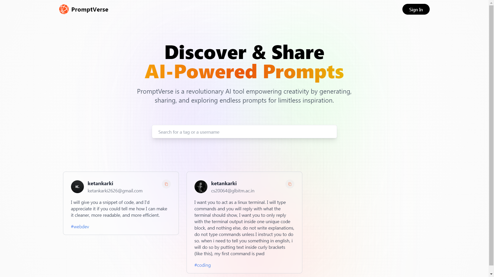

# PromptVerse Website Repository


Welcome to the PromptVerse website repository! This repository contains the source code and assets for the PromptVerse website.
[https://promptverse-ean1299ij-ketankarki.vercel.app/](https://promptverse-ean1299ij-ketankarki.vercel.app/)
## About PromptVerse

PromptVerse is an open-source AI prompting tool designed to help users discover, create, and share creative prompts for various purposes, from writing and art to brainstorming and problem-solving.

## Technologies Used
1. Next.js
2. MongoDB
3. Mongoose
4. TailwindCSS

## Getting Started

To get started with the PromptVerse website locally, follow these steps:

1. Clone this repository to your local machine.

   ```shell
   git clone https://github.com/KetanKarki/promptverse.git
   ```

2. Navigate to the project directory.

   ```shell
   cd promptverse-website
   ```

3. Install the necessary dependencies.

   ```shell
   npm install
   ```

4. Start the development server.

   ```shell
   npm start
   ```

The website should now be running locally at `http://localhost:3000`.

## Usage

- Explore a wide range of creative prompts generated by our AI.
- Create and customize your own prompts to spark inspiration.
- Share your favorite prompts with the PromptVerse community.
- Collaborate with other users on creative projects using shared prompts.

## Contributing

We welcome contributions from the community! If you'd like to contribute to the development of PromptVerse, please connect.

## Issues

If you encounter any issues or have suggestions for improvements, please open an issue on our [Issue Tracker](https://github.com/KetanKarki/promptverse/issues).

## Acknowledgments

I would like to express our gratitude to the open-source community and all contributors who make PromptVerse possible.

Happy creating!
